# Hi, I'm Haoxiang 👋

  <picture>
    <source media="(prefers-color-scheme: dark)" srcset="https://readme-typing-svg.demolab.com?font=IBM+Plex+Sans&amp;weight=500&amp;size=22&amp;pause=1000&amp;color=58A6FF&amp;center=true&amp;vCenter=true&amp;width=620&amp;lines=AI+application+%26+backend+development;LLM+systems+%26+financial+software;Building+reliable+products+with+Python">
    
  </picture>

  B.Sc. Software Engineering @ Beijing University of Technology · building reliable AI applications and backend systems.

---

- 🔭 I'm currently working on **Agentic Trading Lab** and **Fourier Tutor Agent**
- 🌱 I'm strengthening **data structures, algorithms, databases, and backend engineering fundamentals**
- 👯 I'm open to serious collaboration on **AI application and backend projects**
- 💬 Ask me about **A-share backtesting, iFinD integration, and LLM application workflows**
- 📫 Reach me at [2739441541@qq.com](mailto:2739441541@qq.com)
- ⚡ Outside code: **basketball, travel, reading, and guitar**

---

  
  
  
  

  
  
  
  

---

## Selected work

### [Agentic Trading Lab](https://github.com/Open-Finance-Lab/AgenticTrading) · Major contributor

An open-source experimental platform for building, backtesting, and inspecting LLM-powered trading agents.

- Authored **40 merged pull requests** across A-share backtesting, LLM execution, Credits billing, database migrations, and regression testing.
- Integrated iFinD market data with server-side token exchange, caching, and automatic refresh.
- Built A-share execution rules and contributed controlled LLM-provider routing with reservation, settlement, and release of platform Credits.
- Latest cited complete backend regression: **3,943 tests passed**.

[Live demo](https://agentic-trading-lab.vercel.app/) · [My merged pull requests](https://github.com/Open-Finance-Lab/AgenticTrading/pulls?q=is%3Apr+author%3AMrParamecium+is%3Amerged)

### [Fourier Tutor Agent](https://github.com/MrParamecium/Fourier) · Independent project

A browser-based tutor for signal processing and linear systems, connecting textbook materials with guided LLM-assisted learning.

- Built the browser interface and Node.js/WebSocket bridge.
- Organized OCR, textbook pages, figures, formulas, and chapter metadata as traceable learning sources.
- Added guided exercises, understanding checks, progress tracking, and conversation history.

[Live demo](https://aquarius-seven.vercel.app)

---

### GitHub stats

  <picture>
    <source media="(prefers-color-scheme: dark)" srcset="./profile/stats-dark.svg">
    
  </picture>
  <picture>
    <source media="(prefers-color-scheme: dark)" srcset="./profile/top-langs-dark.svg">
    
  </picture>

  <picture>
    <source media="(prefers-color-scheme: dark)" srcset="./profile/streak-dark.svg">
    
  </picture>

  

